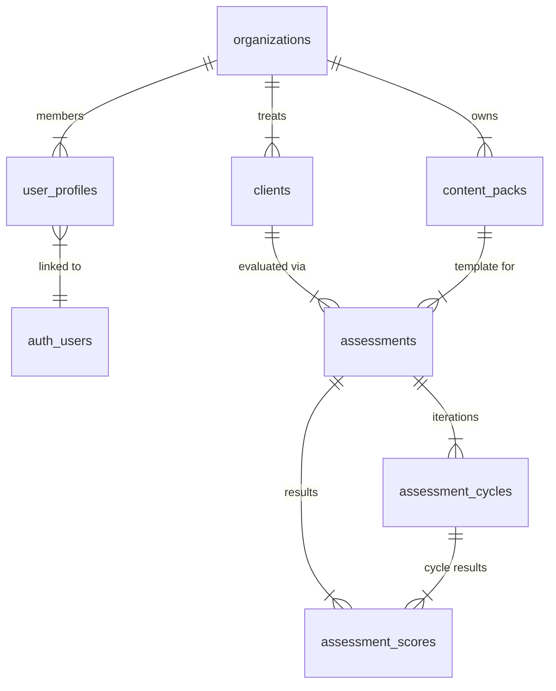

# Database Schema Design

> **Note:** Conceptual schema for onboarding. **Operational truth** for apply order and RPCs: [`supabase_setup.md`](./supabase_setup.md). As-built behavior: [`../audits/complete_codebase_audit_2026_06_10.md`](../audits/complete_codebase_audit_2026_06_10.md).

## Overview
The database uses PostgreSQL hosted on Supabase.
**Critical Rule:** All tables containing tenant-specific data MUST have an `org_id` column and RLS policies enabled.

## Entity Relationship Diagram (High Level)

## Tables

### 1. Multi-Tenancy & Users

#### `organizations`
| Column | Type | Constraints | Description |
|---|---|---|---|
| `id` | UUID | PK, gen_random_uuid() | Unique Tenant ID |
| `name` | Text | Not Null | Clinic Name |
| `created_by` | UUID | FK -> auth.users.id | Creator (Owner) |
| `created_at` | Timestamptz | Default now() | |

#### `user_profiles`
| Column | Type | Constraints | Description |
|---|---|---|---|
| `id` | UUID | PK, FK -> auth.users.id | Link to Supabase Auth |
| `org_id` | UUID | FK -> organizations.id | Tenant context |
| `role` | app_role | | RBAC |
| `full_name` | Text | | |
| `email` | Text | | |
| `created_at` | Timestamptz | Default now() | |
| `updated_at` | Timestamptz | | |

#### `user_invites`
| Column | Type | Constraints | Description |
|---|---|---|---|
| `email` | Text | PK | Invite identifier |
| `org_id` | UUID | FK -> organizations.id | |
| `role` | Text | | Target role |
| `invited_by` | UUID | FK -> auth.users.id | |
| `created_at` | Timestamptz | | |

### 2. Clinical Data (PHI)

#### `clients` (formerly learners)
| Column | Type | Constraints | Description |
|---|---|---|---|
| `id` | UUID | PK | |
| `org_id` | UUID | FK | Tenant Context |
| `first_name` | Text | Not Null | |
| `last_name` | Text | Not Null | |
| `date_of_birth` | Date | | |
| `status` | Text | 'active', 'archived' | |
| `created_by`| UUID | FK | |

### 3. Assessment Content

#### `content_packs` (formerly frameworks)
| Column | Type | Constraints | Description |
|---|---|---|---|
| `id` | UUID | PK | |
| `org_id` | UUID | FK | Tenant Context |
| `title` | Text | Not Null | |
| `pack_data` | JSONB | Not Null | **Stores Domains/Targets Structure** |
| `version` | Text | Default '1.0' | |
| `licence_proof_url`| Text | | Compliance |

### 4. Assessment Data

#### `assessments`
| Column | Type | Constraints | Description |
|---|---|---|---|
| `id` | UUID | PK | |
| `org_id` | UUID | FK | |
| `client_id` | UUID | FK | |
| `content_pack_id` | UUID | FK | |
| `pack_snapshot` | JSONB | Not Null | Frozen copy of pack_data at start time |
| `status` | Text | 'draft', 'in_progress', 'submitted', 'approved' | |
| `assigned_to` | UUID | FK | Therapist |
| `approved_by` | UUID | FK | Senior Therapist/Admin |

#### `assessment_cycles` (New)
| Column | Type | Constraints | Description |
|---|---|---|---|
| `id` | UUID | PK | |
| `assessment_id` | UUID | FK | |
| `cycle_number` | Int | | 1, 2, 3... |
| `status` | Text | 'in_progress', 'locked' | |
| `start_date` | Timestamptz | | |

#### `assessment_scores`
| Column | Type | Constraints | Description |
|---|---|---|---|
| `id` | UUID | PK | |
| `assessment_id` | UUID | FK | |
| `assessment_cycle_id`| UUID | FK | |
| `client_id` | UUID | FK | Redundant for easy query |
| `target_id` | Text | Not Null | ID from pack_data JSON |
| `domain_id` | Text | Not Null | ID from pack_data JSON |
| `score` | Int | | 0-4 usually |
| `metadata` | JSONB | Default {} | **Task Analysis Details** |
| `evidence_files` | JSONB | Default [] | |
| `assessor_user_id` | UUID | FK | |
| `scored_at` | Timestamptz | | |

#### `audit_logs`
| Column | Type | Constraints | Description |
|---|---|---|---|
| `id` | UUID | PK | |
| `org_id` | UUID | FK | Tenant Context |
| `user_id` | UUID | FK | Actor |
| `action` | Text | | e.g. "create_client" |
| `entity_type` | Text | | e.g. "clients" |
| `entity_id` | UUID | | |
| `details` | JSONB | | Changed values, etc. |
| `new_data` | JSONB | | Snapshot of new state |
| `old_data` | JSONB | | Snapshot of old state |
| `created_at` | Timestamptz | | |

## Security (RLS)

### Core Rules
- **Organizations**:
    - `INSERT`: Authenticated users (New Signup).
    - `SELECT`: Linked Users OR Creator.
- **Profiles**:
    - `INSERT`: Own User ID only.
    - `SELECT`: Members of same Organization.
- **Clinical Data** (Clients, Assessments, Packs, Scores):
    - `ALL`: Users in the same `org_id`.
    - `DELETE`: Explicit policies added for Clients/Packs.

### Functions
- `check_user_invite(email)`: Case-insensitive lookup for signup flow.
- `claim_invite()`: Securely retrieves and deletes invite for current user.

## Indexes
- All foreign keys are indexed implicitly or via standard access patterns.
- `pack_data` and `pack_snapshot` are JSONB for flexibilty.
