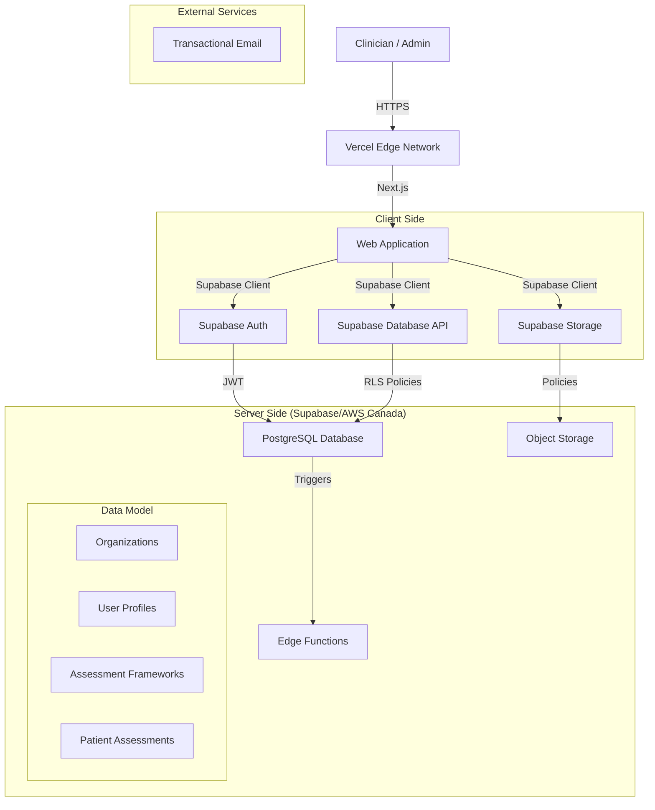

# System Architecture Overview

## Executory Summary
The ABA Skills Assessment Platform is a **multi-tenant, compliant SaaS** designed to digitize clinical assessments while respecting intellectual property laws. The system acts as a "content-agnostic" engine, allowing clinics to define their own assessment frameworks (based on standard tools like ABLLS-R or VB-MAPP) without the platform hosting copyrighted material.

## High-Level Architecture

## Core Components

### 1. Frontend (Next.js)
- **Framework:** Next.js 14+ (App Router).
- **Hosting:** Vercel (configured for Canadian edge usage where possible).
- **State Management:** React Query / TanStack Query (for server state), Zustand (for local UI state).
- **Styling:** Tailwind CSS + Radix UI (accessible primitives).

### 2. Backend & Database (Supabase)
- **Database:** PostgreSQL with Row-Level Security (RLS) enabled on ALL tables.
- **Authentication:** Supabase Auth (wrapping GoTrue).
- **Storage**: Supabase Storage (S3 compatible) for PDF exports and other assets.
- **Region:** **ca-central-1** (Canada Central) to meet data residency requirements.

### 3. Security Layer
- **RLS:** The primary enforcement mechanism. No application code can bypass tenant isolation.
- **Encryption:** At rest (Postgres default) and in transit (TLS 1.2+).
- **Audit Logging:** Postgres triggers recording all changes to sensitive tables (`assessments`, `learners`, `users`).

## Design Principles
1.  **Tenant Isolation First:** Every query must implicitly or explicitly filter by `organization_id`.
2.  **Schema Agnostic:** The system does not know "ABLLS" or "VB-MAPP". It knows `Framework` -> `Domain` -> `Item`.
3.  **Offline Capable:** Clinicians work in areas with poor Wi-Fi. Optimistic updates are preferred.
