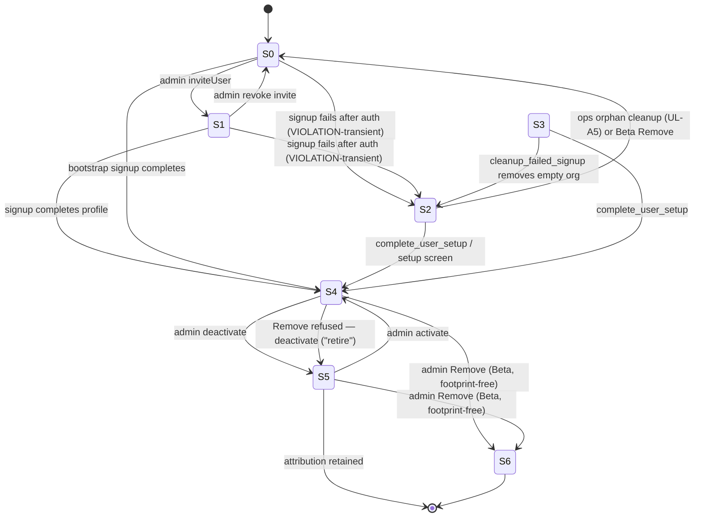

# User Lifecycle Contract

| Field | Value |
|-------|--------|
| **Document type** | Product architecture specification (user identity lifecycle) |
| **Status** | Authoritative contract — decisions locked 2026-08-24; Builder implements without further product interpretation |
| **Binding constraint** | Clinical audit trail and attribution correctness |
| **Settled adjacent work** | M10 user profile authorization — [`user_profile_authorization_contract.md`](./user_profile_authorization_contract.md) (`20260813_user_profile_authorization.sql`); do not weaken INSERT/UPDATE guards |
| **Live incident** | 2026-08-24 — two orphaned `auth.users` rows, no `user_profiles`, empty `organizations`; manual SQL cleanup required; Supabase dashboard delete failed |
| **References** | [`supabase_setup.md`](./supabase_setup.md) §2.1 (email confirmation) · vault SPM Operating Contract §5.5 (Reference-Not-Duplicate) |

This document defines how a person enters Evalis, recovers from partial creation, is removed when appropriate, or is retired when removal would break clinical attribution — with the audit trail as the binding constraint.

It does **not** restate M10 authorization rules, role semantics, or full table DDL. Where lifecycle actions touch privileged profile columns, **M10 wins**.

**Do not commit this document as part of an implementation PR unless separately instructed.**

**Reference-Not-Duplicate (SPM Operating Contract §5.5):** This document owns lifecycle states, transitions, clinical-footprint definition, audit-trail resolution, signup restructuring, and server-side deletion authorization. It references M10 for profile INSERT/UPDATE trust and `supabase_setup.md` for migration apply discipline. It does not duplicate RLS policy text or Team UI layout.

---

# Settled assumptions for implementers

An implementer (Builder) may treat the following as **locked**. Do not re-derive, re-open, or invent alternatives:

| Topic | Settled position |
|-------|------------------|
| **Alpha scope** | **UL-A1 through UL-A5 only.** Remove, Edge Function, and Model A audit migration are **Beta** (UL-β1–β4). Founder decision against an earlier preference to ship Remove before pilot — see §9.1. |
| **Audit trail on Remove** | **Model A only.** Denormalized `actor_email` + `actor_display_name`; nullable `audit_logs.user_id`; backfill per §2.4. **Model B (delete audit rows) is rejected** — if Model A cannot land, **delay Remove**, never delete audit history. |
| **Profile↔auth coupling** | Keep `user_profiles.id` → `auth.users(id)`. Decoupling deferred beyond Beta unless email reuse after Remove becomes a demonstrated operational need. |
| **Retire** | Product language for “cannot Remove — deactivate instead.” Stored status remains `active` \| `inactive`. No `retired` enum. |
| **Invite expiry** | None in Alpha; manual revoke only. |
| **Cross-org invite** | Block at invite creation if email is already an active member in any org (single-org product). |
| **Deactivated sign-in** | Out of scope here — referred to M11. Do not implement a lifecycle-specific login block. |
| **Email confirmation** | Stay **disabled** for Alpha per `supabase_setup.md` §2.1. Re-enable only after Alpha, once deferred bootstrap (§5.5) is verified. |
| **Regulatory erasure** | **Unresolved** (OQ-UL-14). Do not build erasure automation. |
| **UL-A database objects** | RPCs are Postgres objects. They **must** be added as a file under `database/migrations/` and **manually applied** in the Supabase SQL Editor (or equivalent). Per `supabase_setup.md`, **nothing applies them automatically.** |

---

# 0. Verified current state (2026-08-24)

## 0.1 Signup sequence — the defect

`frontend/src/services/auth.ts` `signUp` performs **three sequential client writes** with no transaction and no compensating cleanup:

| Step | Action | On failure |
|------|--------|------------|
| 1 | `supabase.auth.signUp` → creates `auth.users` | Throws; nothing to clean |
| 2a (invite) | `claim_invite()` → returns org/role JSON | — |
| 2b (bootstrap) | `organizations.insert` → creates org with `created_by = auth.uid()` | Throws; **auth identity orphaned** |
| 3 | `user_profiles.insert` | Throws; **auth identity (+ org on bootstrap path) orphaned** |

After M10 (`20260813_user_profile_authorization.sql`), step 3 can **legitimately fail** when:

- Invite email case mismatch between form and auth (less likely — policy uses `auth.users.email`)
- Invite role/org changed or revoked between `claim_invite` and insert
- Admin re-issued invite while target is mid-signup
- Bootstrap insert rejected when org `created_by` ≠ actor (race or wrong `org_id`)
- Profile insert violates CHECK or FK for any other reason

**Observed production outcome:** identity exists, email blocked on re-signup (`User already registered`), no profile (invisible on Team Members), optional empty org.

## 0.2 Hidden recovery path (works today, undiscoverable)

| Path | Mechanism | Where |
|------|-----------|--------|
| **Invited signup failure** | Invite **not consumed** until successful profile INSERT (`user_profiles_consume_invite` trigger, `20260813_user_profile_authorization.sql` lines 151–169) | DB |
| **Late claim** | `signIn` → `claim_invite()` → `user_profiles.upsert` with invite org/role | `auth.ts` lines 76–96 |
| **User action** | Click **Sign In** instead of Sign Up | `Login.tsx` lines 206–216 — no copy explains this |

Bootstrap-path failures (empty org, no profile) **cannot** be healed by late-claim alone — there is no invite row.

## 0.3 Email confirmation (checked, not assumed)

Per `docs/architecture/supabase_setup.md` §2.1:

- **AIM Alpha validation** used **email confirmation disabled** so signup receives an immediate session and runs org/profile creation.
- With confirmation **enabled**, `auth.ts` lines 19–23 return early **without** org/profile creation — a separate orphan class.
- Repo contains **no** post-confirmation bootstrap implementation.

**Locked stance (founder, OQ-UL-15):** Keep email confirmation **disabled for Alpha**. Do not change the signup confirmation setting in the weeks before AIM staff walk the path. Re-enable only **after Alpha**, and only once §5.5 deferred bootstrap is implemented and verified. Until then, Alpha environments follow `supabase_setup.md` §2.1.

## 0.4 Deactivation (exists)

`Users.tsx` lines 279–298 call `userService.updateUser(id, { status })` with values `active` | `inactive` (`20260107_add_user_status.sql`). M10 trigger restricts status changes to org admins (not self). **No hard block on authentication** for inactive users today (M10 non-goal / M11). This contract does **not** resolve deactivated sign-in behaviour (OQ-UL-11 — out of scope).

## 0.5 Removal (does not exist — Beta)

- No admin “Remove user” in `Users.tsx`.
- No client path to `auth.admin.deleteUser`.
- Supabase dashboard delete fails when FK references exist (expected).
- **Alpha does not ship Remove.** Residual mistyped-invite cases use **deactivate + re-invite** (§9.1).

## 0.6 Server-side infrastructure (absent — Beta)

Repository search confirms:

| Expected for Admin API | Found |
|------------------------|-------|
| `supabase/functions/` | **Absent** |
| `supabase/config.toml` | **Absent** |
| Edge Function deploy scripts | **Absent** |
| Non-browser server | **Absent** — Vite SPA + direct Supabase only (`supabase_setup.md` §2) |

`@supabase/functions-js` appears only as a transitive dependency of `@supabase/supabase-js` (`frontend/package.json`). Edge Functions are **deployable on Supabase hosting** via CLI once a project is linked, but **this repo has no established deploy path**. First server-side code is a **Beta** deliverable (UL-β1), not Alpha.

## 0.7 Attribution FK graph (no cascade)

From `database/migrations/20260104_complete_database_definition.sql` and `20260819_assessment_communication_reports.sql` — all reference `auth.users(id)` with **no** `ON DELETE CASCADE` or `ON DELETE SET NULL`:

| Table | Column(s) |
|-------|-----------|
| `organizations` | `created_by` |
| `user_profiles` | `id` (PK → `auth.users`) |
| `user_invites` | `invited_by` |
| `clients` | `created_by` |
| `content_packs` | `uploaded_by` |
| `assessments` | `created_by`, `assigned_to`, `approved_by` |
| `assessment_scores` | `assessor_user_id` |
| `audit_logs` | `user_id` (**NOT NULL** today; Model A makes nullable in Beta) |
| `assessment_communication_reports` | `created_by`, `last_edited_by`, `finalized_by` |

**Rejected in advance:** broad `ON DELETE CASCADE` on these keys — would destroy clinical attribution and audit history.

---

# 1. Lifecycle model

## 1.1 Person vs identity vs profile vs invite

| Concept | Storage | Visible on Team Members? |
|---------|---------|--------------------------|
| **Auth identity** | `auth.users` | No |
| **Profile (member)** | `user_profiles` | Yes |
| **Pending invite** | `user_invites` (PK = email) | Yes (Pending Invitations) |
| **Organization** | `organizations` | No (but scopes all data) |

A “person” in product terms is the combination the app can attribute. Before profile creation, the person is **invisible** to org admins despite holding an email in `auth.users`.

## 1.2 Lifecycle states

| State | Definition | Reachable today? | After UL-A |
|-------|------------|------------------|------------|
| **S0 — Uninvited** | Email not in `user_invites`; no `auth.users` row | Yes (default) | Yes |
| **S1 — Invited** | Row in `user_invites`; no profile | Yes (`userService.inviteUser`) | Yes |
| **S2 — Identity-only** | `auth.users` exists; **no** `user_profiles` | **Yes — accidental** | Transient only; healed by `complete_user_setup` / setup screen; durable S2 → ops runbook (UL-A5) |
| **S3 — Bootstrap-pending** | `auth.users` + empty org (`organizations.created_by = user`, zero profiles in org) + no profile | **Yes — accidental** | Unreachable as durable state — `cleanup_failed_signup` removes empty org |
| **S4 — Active member** | `user_profiles` with `status = 'active'` | Yes | Yes |
| **S5 — Deactivated member** | `user_profiles` with `status = 'inactive'` | Yes | Yes — also the stored state for “retired” product language |
| **S6 — Removed** | No `auth.users`; no `user_profiles`; email reusable; audit rows retain meaning via Model A | **No** | **Beta only** (UL-β) |
| **S7 — Retired (product language)** | Same storage as S5 (`inactive`); email **not** reusable; clinical attribution retained | Partial (deactivate exists; no login block) | Same — “Retire” is UI language when Remove is refused, **not** a separate enum |

**Note:** S2 and S3 are **not product states** — they are **integrity violations**. UL-A makes them unreachable as durable states (or self-healing), not features.

## 1.3 Legal transitions



| Transition | Trigger | Preconditions | Phase |
|------------|---------|---------------|-------|
| S0→S1 | `inviteUser` | Admin; email not already a member in any org (§7.2) | Alpha |
| S1→S0 | `deleteInvite` | Admin | Alpha |
| S1→S4 | Successful profile creation | Invite matches auth email; M10 INSERT rules | Alpha |
| S0→S4 | Bootstrap signup via `complete_user_setup` | First org + admin profile in one DB transaction | Alpha |
| S2/S3→S4 | `complete_user_setup` (§5) | Valid invite or bootstrap eligibility | Alpha |
| S4↔S5 | `updateUser({ status })` | Admin; not self | Alpha (exists) |
| S4/S5→S6 | Admin **Remove** | **No clinical footprint** (§3); Model A schema live; Edge Function (§4) | **Beta** |
| Remove refused | Admin offered **Deactivate** | Has clinical footprint; UI explains counts (§3.3) | **Beta** (Alpha: deactivate only, no Remove UI) |

## 1.4 Identity-only (S2) — accidental reachability today

Created when `auth.signUp` succeeds and profile insert fails. User sees generic error; Supabase returns `User already registered` on retry. Recovery via sign-in works **only if** a matching `user_invites` row still exists (S2 from invite path). Bootstrap S3 requires `complete_user_setup` or manual ops cleanup.

**UL-A target:** S2/S3 become **transient** (self-healing within session or explicit setup screen), not durable. Durable orphans that predate UL-A or survive edge cases are cleaned via **UL-A5 ops runbook** (founder SQL), not product UI, until Beta.

---

# 2. Audit-trail resolution (central architectural choice)

## 2.1 The tension

- `audit_logs.user_id` is **NOT NULL** and references `auth.users`.
- Footprint-free users (mistyped invite, test account) may still have **`audit_logs` rows** if they triggered instrumented actions (`auditService.log` in clients, assessments, packs, exports — `frontend/src/services/audit.ts`).
- Current codebase does **not** audit sign-in itself; the tension remains because **any** successful authenticated action can write audit rows, and future instrumentation may add login audit.
- Postgres blocks `auth.users` deletion while **any** FK reference exists, including audit.
- Deleting audit rows to unblock deletion **destroys the record of what happened** — the opposite of an audit trail.

**This is not resolved by cascade deletes.** It requires an explicit product-technical model for what “remove user” means when audit rows exist.

## 2.2 Models compared

### Model A — Denormalized actor identity on audit rows (**adopted — Beta**)

**Mechanism (locked — OQ-UL-2, OQ-UL-3):**

- Add to `audit_logs`: **`actor_email text`**, **`actor_display_name text`**.
- Do **not** store `actor_role`. Where role-at-action-time matters, it belongs in that action’s own payload; a second copy invites drift.
- Populate on **every insert** (extend `auditService.log` and any future server writers).
- Migration: make `user_id` **nullable**; change FK to `ON DELETE SET NULL`.
- Audit display prefers denormalized fields when `user_id` IS NULL; joins to `user_profiles` when present.

| Preserves | Costs | Precedent |
|-----------|-------|-----------|
| Audit row meaning after identity removal | Schema migration; backfill ~2,334 existing rows; all write paths must populate snapshots | Audit is **durable**; identity removal is **explicit** |
| Email reuse via auth deletion | Nullable FK + display-layer change | General solution for retire + remove |
| Clinical FK attribution unchanged | One-time backfill | Independent of clinical footprint |

**Independent merit:** Even without a Remove button, clinicians retiring staff need audit logs that remain readable years later if auth emails change. Denormalization is standard practice for immutable audit stores.

### Model B — Delete audit rows for footprint-free users only (**rejected**)

**Mechanism (not to be implemented):** Define removal eligibility as zero clinical footprint; delete all `audit_logs` where `user_id = target` immediately before profile/auth delete.

**Founder decision (OQ-UL-4): NO.** Disposable audit history is not an acceptable fallback. If Model A cannot land in Beta, the correct response is to **delay Remove further**, not to delete audit rows. Model B is rejected **outright** — it is not a contingency, not a stopgap, and not an Alpha or Beta option.

**Reasoning:** Establishing that audit history is conditionally disposable undermines the clinical product’s claim that the audit trail is a record of what happened. Cost savings do not justify that precedent.

### Model C — Retained tombstone (profile without auth) (**deferred beyond Beta**)

**Mechanism:** Keep a profile row after auth is gone so FKs and display names survive.

| Preserves | Costs | Precedent |
|-----------|-------|-----------|
| All FKs including `user_profiles.id` | **Blocked by current schema:** `user_profiles.id` PK **is** FK → `auth.users(id)` | Email reuse requires **new** auth UUID → new person id |
| Team list shows ghosts unless filtered | Decoupling profile from auth is a **major** identity model change | Conflates “removed” with “retired colleague” |

**Founder decision (OQ-UL-5): DEFER.** Not Alpha, not Beta. Revisit only if email reuse becomes a **demonstrated operational need after Remove ships**.

**Retire path without decoupling:** Keep auth identity; set `status = 'inactive'`; email **not** freed (correct for clinical footprint cases).

### Model D — Reassign attribution to org admin on delete (**rejected**)

**Mechanism:** Before delete, `UPDATE` all clinical FKs to a designated “org archive” user.

**Assessment: Rejected.** Falsifies who entered scores and approvals — unacceptable for clinical integrity unless explicit regulatory “break glass” with immutable log of reassignment (out of scope; see also OQ-UL-14).

## 2.3 Choice (binding)

| Concern | Binding choice |
|---------|----------------|
| General audit-trail resolution | **Model A** |
| Alpha | Model A **not required** — Remove does not ship; audit schema unchanged in Alpha |
| Beta Remove precondition | Model A migration + write-path snapshots **must** land before Remove UI/function; if they cannot, **delay Remove** (never Model B) |
| Retire / clinical footprint | **Deactivate** (`inactive`); do not delete auth; attribution FKs unchanged |

## 2.4 Schema changes required (Model A — Beta only)

To be applied **manually** in Supabase SQL Editor per `supabase_setup.md` — `database/migrations/` files are not auto-applied:

1. `ALTER TABLE audit_logs ADD COLUMN actor_email text, ADD COLUMN actor_display_name text;`
2. **Backfill (locked — OQ-UL-3):** join `user_profiles` for resolvable actors; fall back to `auth.users` where needed; where unjoinable, write the literal **`[removed actor]`**. Do not infer or approximate an identity.
3. `ALTER TABLE audit_logs ALTER COLUMN user_id DROP NOT NULL;`
4. FK policy: `ON DELETE SET NULL` on `audit_logs.user_id` → `auth.users(id)` (replace existing FK).

**No change** to clinical attribution FKs as part of Model A.

---

# 3. Clinical footprint definition

## 3.1 Product concept

**Clinical footprint** = the user has **directly attributable involvement in learner/clinical artifacts** such that removing their identity would falsify or break the meaning of stored clinical records, **or** deleting their `auth.users` row is blocked by FK integrity on those artifacts.

Audit rows record **operational activity**; they are **not** clinical artifacts themselves, but must remain meaningful after removal (§2 — Model A).

## 3.2 Footprint predicate (exact)

Define `has_clinical_footprint(p_user_id uuid) returns boolean` as true when **any** of the following hold:

| # | Table | Column | Rationale |
|---|-------|--------|-----------|
| F1 | `clients` | `created_by` | Created learner record |
| F2 | `content_packs` | `uploaded_by` | Authored/uploaded assessment material |
| F3 | `assessments` | `created_by` | Created assessment instance |
| F4 | `assessments` | `assigned_to` | Assigned as assessor |
| F5 | `assessments` | `approved_by` | Approved assessment |
| F6 | `assessment_scores` | `assessor_user_id` | Entered/edited scores (**strongest signal**) |
| F7 | `assessment_communication_reports` | `created_by` | Authored report |
| F8 | `assessment_communication_reports` | `last_edited_by` | Edited report |
| F9 | `assessment_communication_reports` | `finalized_by` | Finalized report |

**Explicitly excluded from clinical footprint** (do not block Remove):

| Table | Column | Rationale |
|-------|--------|-----------|
| `audit_logs` | `user_id` | Operational audit — preserved via Model A, not clinical artifact |
| `user_invites` | `invited_by` | Administrative metadata — on Remove, **cascade revoke** pending invites where `invited_by = target` (OQ-UL-6 locked) |
| `organizations` | `created_by` | Bootstrap metadata; cleanup via empty-org rules (§5) |

**Identity-only (S2) users:** typically **no** clinical footprint. Alpha cleanup is ops SQL (UL-A5); Beta Remove may cover profile-bearing footprint-free users.

## 3.3 Admin-facing explanation (Remove refused — Beta)

When `has_clinical_footprint` is true, Remove is **refused**. UI must show **concrete counts**, not a generic error:

- Example shape (founder-owned copy): “Cannot remove — this user entered scores on **N** targets across **M** assessments, approved **A** assessments, … Deactivate instead.”

Implement via RPC returning `{ allowed: false, reasons: [{ code, count }] }` — not client-side guessing.

## 3.4 Deactivate vs Remove vs Retire

| Action | Footprint | Auth identity | Profile | Email reusable | Team list | Phase |
|--------|-----------|---------------|---------|----------------|-----------|-------|
| **Deactivate** | any | kept | `inactive` | No | shown inactive | Alpha (exists) |
| **Remove** | none | deleted | deleted | Yes | gone | **Beta** |
| **Retire** (label) | yes | kept | `inactive` | No | shown inactive + explanation | Product language only |

**Locked (OQ-UL-7):** Reuse existing `inactive`. Do **not** add a `retired` enum value. “Retire” remains product language for the refusal path, not a stored state.

---

# 4. Deletion mechanism (server-side) — Beta

## 4.1 Why server-side is mandatory

`auth.admin.deleteUser` requires the **service_role** key. Browser exposure is catastrophic (full DB bypass). Evalis has no server today — **first server-side component is required** for Remove, and ships in **Beta (UL-β1)**, not Alpha.

## 4.2 Deployability assessment (honest)

| Question | Finding |
|----------|---------|
| Can Supabase Edge Functions run? | **Yes, on Supabase platform** — standard Deno functions with `SUPABASE_SERVICE_ROLE_KEY` secret |
| Is it set up in this repo? | **No** — no function source, config, or deploy script |
| Hosting coupling | Frontend deploy (Vite static) is independent; functions deploy via `supabase functions deploy` after `supabase link` |
| Alternative | Small Node/Cloudflare worker elsewhere — **more** operational surface than Edge Function adjacent to Supabase Auth |

**Binding recommendation for Beta:** Supabase Edge Function `admin-remove-user` as first server component — lowest moving parts given existing Supabase Auth/Postgres coupling.

## 4.3 Authorization model (function must enforce — service_role ignores RLS)

The function **must not** trust client-supplied role or org claims alone. Minimum checks:

| # | Rule |
|---|------|
| A1 | Caller presents valid **user JWT** (not service key) |
| A2 | Resolve caller profile via service client; caller `status = 'active'` |
| A3 | Caller `role = 'admin'` |
| A4 | Target profile exists and `target.org_id = caller.org_id` |
| A5 | Target `id ≠ caller.id` (no self-delete) |
| A6 | `has_clinical_footprint(target.id) = false` |
| A7 | After delete, org has **≥1 active admin** (count active admins excluding target) |
| A8 | Write audit row **before** delete (service role): action `DELETE`, entity `user`, with actor snapshot (`actor_email`, `actor_display_name`) + target snapshot |
| A9 | **No rate limit** (OQ-UL-8 locked) — admin authorization already bounds callers |

**Additional surfaces (locked):**

- **S2 identity-only (no profile):** Product Remove UI targets profile-bearing users. Identity-only orphans are cleaned via **operations SQL only, founder-run**, until Beta product path exists if ever. UL-A5 runbook must carry the **2026-08-24 guarded transaction pattern**: explicit target ids, guard clauses that abort on any unexpected footprint, never a bare delete (OQ-UL-9).
- **Invited-by references:** On Remove, **cascade revoke** all pending `user_invites` where `invited_by = target`. An invitation from someone who no longer exists must not remain redeemable (OQ-UL-6).

## 4.4 Delete ordering and partial completion

**Goal:** no state where auth is gone but profile exists, or profile gone while auth remains with blocked email, or audit attribution lost.

**Order (single function invocation, service role transaction where possible):**

```
1. BEGIN (SQL transaction via service client)
2. Snapshot target identity fields for audit
3. INSERT audit_logs (DELETE user) with actor + target snapshots (Model A columns)
4. Cascade-revoke pending invites where invited_by = target
5. Rely on ON DELETE SET NULL for audit_logs.user_id (Model A FK) — or null explicitly before auth delete
6. DELETE FROM user_profiles WHERE id = target
7. COMMIT
8. auth.admin.deleteUser(target_id)   -- Auth API outside PG transaction
9. On auth delete failure: emit critical log; return partial error; ops playbook to retry deleteUser
   (OQ-UL-10 — NO automated restore job)
```

**Idempotency:** Second call for same deleted user → 404/not-found, success shape (already removed).

**Orphan empty org cleanup:** If target was sole member and bootstrap org, invoke empty-org cleanup when zero profiles remain (§5).

**Inverse partial (auth deleted, profile remains):** **Worse** — email freed but ghost profile. Function must **delete profile first**, auth last; never delete auth if profile delete failed.

**Locked (OQ-UL-10):** Auth delete failure after profile delete → **operations playbook + critical log**. No automated restore job. Correct write ordering should make this near-unreachable; an automated repair path for a near-unreachable state is more risk than the state itself.

## 4.5 Attack surface and bounds

| Risk | Mitigation |
|------|------------|
| Stolen user JWT + brute force function | A2–A4; short JWT TTL; function logs all attempts |
| Stolen service_role key | Supabase secret storage only; never in frontend; rotate on leak |
| Cross-org delete | A4 org match on profile row |
| Privilege escalation | A3 admin role from DB not JWT claims |
| Denial of service (delete all admins) | A7 last-admin guard |
| CSRF from browser | Function validates Authorization header; CORS restrict to app origin |

Function returns **generic errors** to client; detailed reasons in server logs only.

## 4.6 Alpha stance on Remove

**Remove is not built in Alpha.** Alpha ships signup healing (§5), Login UX (§6), profile-missing gate, and ops runbook (UL-A5). Admins use **deactivate** for unwanted members. This is the **authoritative Alpha cut** (§9.1), not a fallback preference.

---

# 5. Signup restructuring (UL-A — Alpha mandatory)

## 5.0 Manual migration requirement (prominent)

UL-A introduces **database objects** (`complete_user_setup`, `cleanup_failed_signup`, `lookup_email_lifecycle_state`, and any supporting helpers).

| Requirement | Detail |
|-------------|--------|
| **Location** | Add SQL under `database/migrations/` with a dated filename |
| **Apply method** | **Manual** — Supabase SQL Editor or psql as documented in [`supabase_setup.md`](./supabase_setup.md) |
| **Automation** | **None.** This repo does not auto-apply `database/migrations/`. Frontend `supabase/migrations/` is a separate, incomplete chain — do not assume CLI push applies UL-A RPCs |
| **Order** | Apply after M10 (`20260813_user_profile_authorization.sql`) is present; do not re-run the destructive `20260104_complete_database_definition.sql` on live |

Shipping UL-A frontend code without applying the migration leaves the orphan bug unfixed.

## 5.1 Design goal

Make **S2/S3 durable orphans unreachable** — not merely unlikely. Empty organizations from failed bootstrap **must not survive**.

## 5.2 Why identity cannot be “last” in browser-only architecture

`auth.signUp` creates the identity outside Postgres transactions. Client cannot atomically bundle Auth API + SQL. **True atomicity** requires either:

- Server orchestrator (Edge Function owns signUp + SQL) — **Beta optional** (UL-β4), or
- **Compensating actions** + **idempotent completion RPC** on retry/sign-in — **Alpha path**

## 5.3 Binding model — idempotent `complete_user_setup` RPC (DB) + client orchestration

**Alpha (no Edge Function for signup):**

Move org/profile creation into a **`SECURITY DEFINER`** RPC `complete_user_setup(p_full_name text, p_org_name text)` that:

1. Reads `auth.uid()` and `auth.users.email`.
2. If profile already exists for uid → return success (idempotent).
3. If matching `user_invites` row → insert profile with invite `org_id`/`role`; trigger consumes invite.
4. Else if bootstrap allowed (no profile; org with `created_by = uid` and no members **OR** new org creation) → create org if needed, insert admin profile.
5. Enforces **same rules as M10 INSERT policy** internally (do not weaken).
6. Runs in **one DB transaction**.

**Client `signUp` becomes:**

```
1. auth.signUp
2. if no session → deferred path (§5.5) — not exercised while confirmation disabled for Alpha
3. complete_user_setup(fullName, orgName)
4. on RPC failure → cleanup_failed_signup() then throw user-facing error with recovery hint
```

**Client `signIn` adds:**

```
after session:
  if no profile → complete_user_setup(fullName?, orgName?) or dedicated setup screen
  else existing late-claim path folded into same RPC
```

**`cleanup_failed_signup()` RPC (SECURITY DEFINER):**

- Deletes organizations where `created_by = auth.uid()` and **no** `user_profiles` reference that org.
- Does **not** delete auth identity (requires Admin API — Beta Remove or ops).
- Idempotent.

### 5.4 Orphan state unreachable proof

| Failure point | After restructuring |
|---------------|---------------------|
| auth ok, RPC fail (invite) | No org created; invite remains; sign-in + RPC succeeds |
| auth ok, RPC fail (bootstrap) | `cleanup_failed_signup` removes empty org; sign-in + RPC retries bootstrap |
| auth ok, org deleted, RPC retry ok | Profile created — S4 |

**Remaining transient:** auth without profile between steps 1–3 — user is S2 for seconds until sign-in/RPC completes. UI must show **Complete setup** not blank app (UL-A4).

### 5.5 Email confirmation deferred bootstrap

When `signUp` returns no session (`auth.ts` lines 19–23):

- **Do not** create org/profile client-side.
- After confirmation, first authenticated session must call `complete_user_setup` (same RPC).
- **Locked:** Do not re-enable email confirmation until **after Alpha** and this path is verified (OQ-UL-15). Update `supabase_setup.md` §2.1 re-enable criteria when that ships.

### 5.6 Signup Edge Function (UL-β4)

Single `signup-orchestrator` with Admin API createUser + RPC can shorten S2 window to zero. **Deferred to Beta / post-Alpha** — UL-A RPC path is sufficient for pilot.

---

# 6. `User already registered` experience (UL-A3)

## 6.1 Required behaviour (not copy)

When signUp returns “already registered” / equivalent:

| Condition | App behaviour |
|-----------|---------------|
| Email has pending invite | Switch to sign-in mode; explain invite is waiting; after sign-in run `complete_user_setup` |
| Email has auth identity, no profile (S2) | Switch to sign-in mode; explain account exists but setup incomplete; after sign-in show setup completion |
| Email is active member | Switch to sign-in mode; do not expose org details |
| Email is deactivated member | Switch to sign-in mode; do not invent a lifecycle-specific block or banner policy — **M11 owns deactivated sign-in** (OQ-UL-11 out of scope). Minimal disclosure via lifecycle lookup may return `inactive`; Login must not invent M11 behaviour |

**Implementation hook:** on signUp error, call RPC `lookup_email_lifecycle_state(lookup_email)` (SECURITY DEFINER, **minimal disclosure** — enum only, no PHI) returning `{ state: 'unknown' | 'invited' | 'identity_only' | 'active' | 'inactive' }`.

## 6.2 User must understand

- Sign Up vs Sign In are not interchangeable when an identity already exists.
- Incomplete setup is **finished by signing in**, not by creating a new account.
- Admin can revoke/reissue invite if role changed.

Founder owns exact strings.

---

# 7. Pending invites

## 7.1 Definitions

| Term | Meaning |
|------|---------|
| **Issue** | Insert `user_invites` (`userService.inviteUser`) — blocked if email already active member in any org (§7.2) |
| **Revoke** | Delete invite row (`userService.deleteInvite`) — **exists** |
| **Re-issue** | Revoke + issue new row — email PK prevents duplicate; must revoke first |
| **Expire** | **None for Alpha** (OQ-UL-12). Manual revocation only; document in UL-A5 runbook |

## 7.2 Invite + orphaned identity / cross-org

| Scenario | Contract behaviour |
|----------|-------------------|
| Invite pending, S2 identity exists | `complete_user_setup` on sign-in consumes invite when profile insert succeeds |
| Admin revokes invite while S2 exists | User can sign in but cannot join org via invite; show invite revoked / contact admin |
| Admin re-issues with different role | User must complete setup matching **new** invite; RPC reads live invite |
| Admin issues invite for email already active in **any** org | **Block at invite creation** (OQ-UL-13) — Evalis is single-org per user; multi-org is not a product direction |
| On Beta Remove of inviter | Cascade revoke pending invites where `invited_by = target` (OQ-UL-6) |

## 7.3 Is `deleteInvite` sufficient?

**For revoke:** yes, for org admins via RLS.

**Insufficient alone for:**

- Re-issue workflow UX (revoke + invite)
- Orphan identity pairing (needs §6 lookup + §5 RPC)
- Cross-org active-member check (must add at invite creation)
- Expiration (none in Alpha — runbook documents manual revoke)

---

# 8. What this contract does not cover

| Topic | Reason |
|-------|--------|
| Role permission matrix redesign | M10 settled |
| Blocking inactive users at login (M11) | Explicit M10 non-goal; OQ-UL-11 out of scope for this contract |
| MFA, password policy, session timeout | Out of scope |
| Multi-clinic / multi-org per user | Out of scope; OQ-UL-13 blocks cross-org invites |
| Merging duplicate users | Separate future contract |
| Bulk import of staff | Out of scope |
| GDPR/CCPA erasure requests | **Unresolved — OQ-UL-14**; legal review required; Alpha/Beta scope decisions do **not** answer this |
| `check_user_invite` granted to `anon` | M10 non-goal; lifecycle lookup RPC is separate |
| Client-side audit trust model | Unchanged — server audit on delete only (Beta) |
| Automated orphan sweeper cron | Ops optional; contract defines manual + RPC healing |
| Profile↔auth decoupling | Deferred beyond Beta (OQ-UL-5) |

---

# 9. Phased implementation and Alpha cut line (**authoritative**)

**Context:** Partner org clinical staff onboarding in ~3 weeks. Production DB was cleaned by hand on **2026-08-24** and is currently correct.

## 9.1 Alpha — **UL-A1 through UL-A5 only** (founder decision, OQ-UL-1)

**Authoritative cut:** Alpha ships **UL-A1–A5**. Remove, the Edge Function, and the Model A audit migration are **out of Alpha**.

This decision was made **against an explicit earlier preference for shipping Remove before pilot**. It is intentional, not an oversight. Reasoning:

1. The production database was cleaned on 2026-08-24 and is currently correct.
2. UL-A makes the orphan state **unreachable**, rather than merely rarer.
3. The residual Alpha need is a **mistyped invite**, which **deactivate + re-invite** covers at the cost of one occupied email address.
4. Introducing this product’s **first server-side component** together with a migration rewriting **~2,334 audit rows** in the three weeks before a clinical pilot is a **materially worse risk** than that cost.

| ID | Deliverable | Notes |
|----|-------------|-------|
| **UL-A1** | `complete_user_setup` + `cleanup_failed_signup` RPCs | **Manual migration** required (§5.0) |
| **UL-A2** | Rewire `auth.ts` signUp/signIn to use RPCs | Fixes root sequence |
| **UL-A3** | Login behaviour for “already registered” + `lookup_email_lifecycle_state` | Surfaces hidden recovery |
| **UL-A4** | Profile-missing gate in app shell | Authenticated + no profile → setup screen |
| **UL-A5** | Ops runbook: break-glass orphan cleanup | Founder-only; **2026-08-24 guarded transaction pattern** — explicit ids, abort on unexpected footprint, never bare delete; document manual invite revoke (no expiry) |

**Explicitly out of Alpha:**

| ID | Deliverable |
|----|-------------|
| **UL-β1** | Edge Function `admin-remove-user` |
| **UL-β2** | Model A audit migration + write-path snapshot + backfill |
| **UL-β3** | Team UI Remove button + footprint RPC + refusal UX |
| **UL-β4** | Signup Edge Function orchestrator |

## 9.2 Beta (post-pilot, before general availability)

| Obligation | Detail |
|------------|--------|
| Model A | Manual migration + backfill per §2.4; `auditService.log` populates snapshots |
| Remove | End-to-end with clinical footprint checks; cascade-revoke invites; no rate limit |
| Audit UI | Reads denormalized fields when `user_id` is null |
| Email confirmation | May re-enable only after §5.5 verified |
| If Model A slips | **Delay Remove** — do not delete audit rows |

## 9.3 Mistyped invites in Alpha

Mistyped invite → wrong person becomes member (or wrong email invited):

1. **Revoke** pending invite if not yet accepted, or **deactivate** if accepted.
2. **Invite** the correct email.
3. Wrong email remains occupied in `auth.users` until **Beta Remove** (if footprint-free) or permanently if they gained clinical footprint (deactivate only).

Email reuse for the *same* address after a wrong signup **requires Beta Remove**. Alpha accepts that cost.

## 9.4 Sequencing within Beta

| Slice | Contents |
|-------|----------|
| **UL-β2a** | Audit denormalization migration + `auditService.log` snapshot fields + backfill |
| **UL-β2b** | `has_clinical_footprint` RPC + admin refusal messages |
| **UL-β2c** | Edge Function remove + Users UI + invite cascade revoke |

**Do not ship UL-β2c before UL-β2a.** Model A is a hard precondition for Remove.

---

# 10. Decision log (OQ-UL)

Questions formerly open. Silence is not approval for future questions; these are **locked** except as marked.

| ID | Decision | Made by | Reasoning |
|----|----------|---------|-----------|
| **OQ-UL-1** | **RESOLVED — Alpha = UL-A1–A5 only;** Remove / Edge Function / Model A → Beta | Founder | Against earlier preference for pre-pilot Remove. DB cleaned 2026-08-24; UL-A makes orphans unreachable; mistype covered by deactivate+re-invite; first server component + 2,334-row audit rewrite before clinical pilot is worse risk. |
| **OQ-UL-2** | **RESOLVED —** columns `actor_email`, `actor_display_name`; **no** `actor_role` | Founder | Role-at-action-time belongs in the action payload; a second copy drifts. |
| **OQ-UL-3** | **RESOLVED —** backfill join `user_profiles`, else `auth.users`; unjoinable → literal `[removed actor]` | Founder | Do not infer or approximate identity for an audit row. |
| **OQ-UL-4** | **RESOLVED — Model B rejected outright** | Founder | Disposable audit is unacceptable; if Model A slips, delay Remove. |
| **OQ-UL-5** | **RESOLVED — defer** profile↔auth decoupling beyond Beta | Founder | Revisit only if email reuse after Remove is a demonstrated need. |
| **OQ-UL-6** | **RESOLVED — cascade revoke** pending invites on Remove | Founder | Invites from a non-existent person must not remain redeemable. |
| **OQ-UL-7** | **RESOLVED — reuse `inactive`**; no `retired` enum | Founder | “Retire” is product language for the refusal path, not a stored state. |
| **OQ-UL-8** | **RESOLVED — no rate limit** on remove function | Founder | Beta-scoped; function-side admin auth already bounds callers. |
| **OQ-UL-9** | **RESOLVED — ops SQL only** for identity-only orphans until Beta; UL-A5 carries 2026-08-24 guarded pattern | Founder | Explicit ids, abort on unexpected footprint, never bare delete. |
| **OQ-UL-10** | **RESOLVED — ops playbook + critical log**; no automated restore | Founder | Near-unreachable if ordering is correct; automated repair is more risk than the state. |
| **OQ-UL-11** | **OUT OF SCOPE** — deactivated sign-in → M11 | Founder / SPM | Confirmed; this contract does not resolve it. |
| **OQ-UL-12** | **RESOLVED — no invite expiry** for Alpha; manual revoke in runbook | Founder | Avoid new retention/TTL policy before pilot. |
| **OQ-UL-13** | **RESOLVED — block** invite if email already active in any org | Founder | Single-org product; multi-org is not a direction taken. |
| **OQ-UL-14** | **OPEN — unresolved** | — | Regulatory erasure vs clinical retention requires **legal review**. Alpha/Beta scope decisions do **not** answer this. Do not build erasure automation. Implications: Remove/deactivate cannot be assumed to satisfy a “right to be forgotten”; clinical retention may legally dominate. Escalate before any erasure feature. |
| **OQ-UL-15** | **RESOLVED — re-enable email confirmation after Alpha only** | Founder | Changing signup days before AIM staff walk it is not worth the trade. |

---

# 11. Acceptance checklist (Overseer)

**Alpha (UL-A):**

- [ ] Manual migration for UL-A RPCs applied to the target Supabase project (not merely committed to repo)
- [ ] Failed invite signup leaves invite row; sign-in completes profile via RPC
- [ ] Failed bootstrap signup leaves **no** empty org after cleanup RPC
- [ ] “User already registered” routes user to sign-in with lifecycle-appropriate explanation
- [ ] Authenticated user without profile sees setup screen, not blank shell
- [ ] M10 INSERT rules unchanged — falsification tests still pass
- [ ] Ops runbook exists with 2026-08-24 guarded orphan cleanup pattern + manual invite revoke
- [ ] Invite creation blocked when email is already an active member in any org
- [ ] Email confirmation remains disabled for Alpha environments

**Beta (UL-β):**

- [ ] Model A migration applied manually; backfill uses `[removed actor]` only when unjoinable
- [ ] Remove refused with footprint counts; deactivate offered (“retire” language)
- [ ] Remove succeeds footprint-free; email reusable; audit rows retain meaning (no audit row deletion)
- [ ] Pending invites by removed user are cascade-revoked
- [ ] Edge Function enforces A1–A8; self-delete and last-admin blocked; no rate limit
- [ ] Auth-after-profile-delete failure: critical log + ops playbook (no auto-restore)

---

# 12. Architecture dissent (recorded)

The Alpha deferral of Remove is accepted as decided. One residual hole remains and should not be argued away:

**Occupied email until Beta.** Deactivate + re-invite covers the common mistyped-*invite* case (wrong address never belonged to the intended clinician). It does **not** free an email when the *intended* clinician’s address was used in a failed or wrong signup and that address must later join Evalis. Until Beta Remove (and Model A), that email stays blocked. UL-A5 ops SQL can free footprint-free orphans; it is founder-only and not discoverable to partner admins. If a pilot admin hits this in week one, the escape hatch is ops, not product.

This is an accepted cost of OQ-UL-1, not an unresolved question. Raise it only if pilot evidence shows the hole is more frequent than mistype-and-deactivate.

---

# Document history

| Date | Change |
|------|--------|
| 2026-08-24 | Initial user lifecycle contract from live orphan incident, verified against `auth.ts`, `Users.tsx`, M10 migration, and schema FK graph |
| 2026-08-24 | Amendment: lock OQ-UL-1–13 and OQ-UL-15; reject Model B; authoritative Alpha cut UL-A1–A5; Model A Beta-only; OQ-UL-14 remains open; implementer settled-assumptions section; manual migration prominence |
